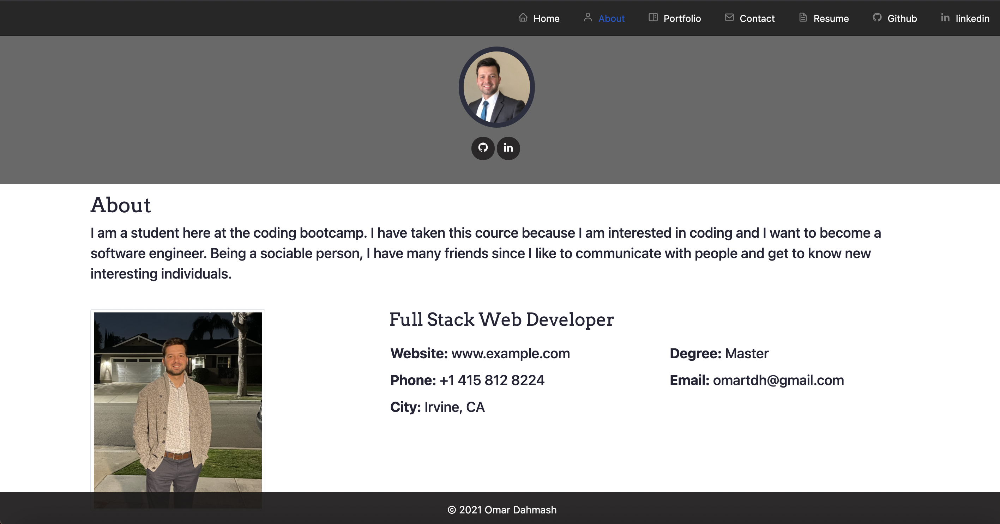
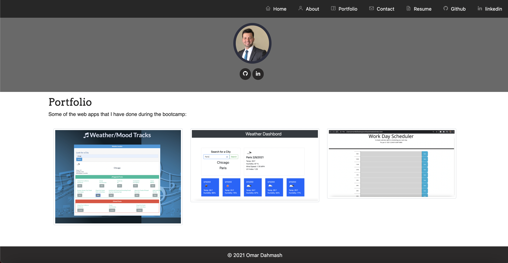
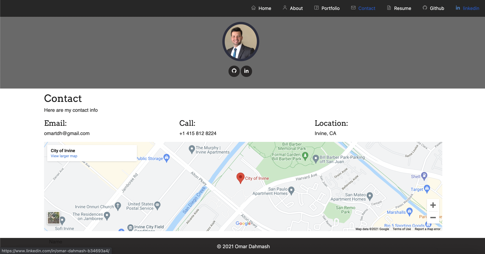
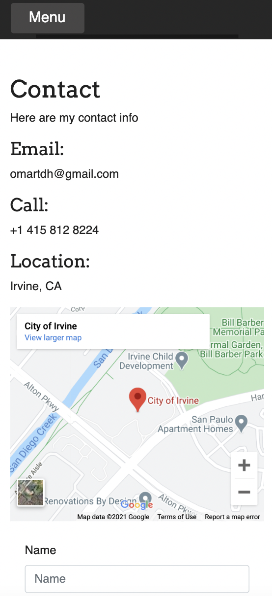
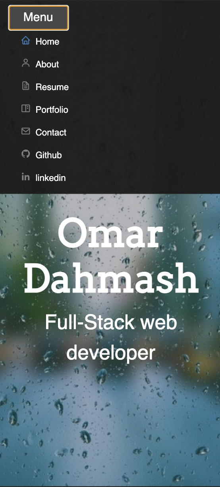

# reactPortfolio

# Portfolio

License for this app is : MIT

# Table of Contents

- [Description](#description)
- [License](#license)
- [Questions](#questions)
- [Demo](#demo)

## Description:
    This project is a react portfolio website about me, showing information about me such as my contact info and some of my previous apps that I developed, as well as a cklickable resemue button that it allows you to download my resume 
    -used a form-group class to create a form to allow the user to input their info and add a message.
    -used a card class and 3 row classes to put 3 pictures on a stack order and made it mobile accessible, Pictures are 3 we applications that I worked on during the bootcamp. 

## License:
    For information about the license, click the link below.

- [License](https://opensource.org/license/random)

## Questions:
    Contact me at the following Link:

-[GitHub Profile](https://github.com/omartdh)

    Send me an email at: omartdh@gmail.com

## Demo:

